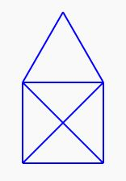

# Exercice 2

En utilisant les commandes fournies par la bibliothèque `drawing.h`, tracer le motif ci-dessous. Attention, il est interdit de passer 2 fois sur le même trait.

@[Sample paper]({"stubs": ["main.c"],"command": "sh /project/target/run.sh", "project" : "drawing"})