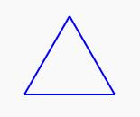
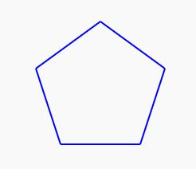
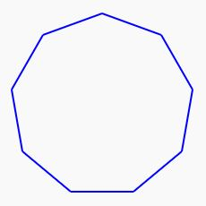
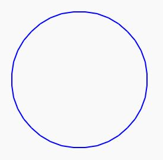

# Exercice 3

En utilisant les commandes fournies par la bibliothèque `drawing.h`, écrire une fonction permettant de tracer n'importe quel polygone régulier convexe (cf [définition polygone régulier](https://fr.wikipedia.org/wiki/Polygone_r%C3%A9gulier)). La fonction recevra en paramètre le nombre de coté du polygone et la taille des cotés.

## Quelques polygones réguliers

|--------:|-------:|-------:|-------:|
|||||

@[Sample paper]({"stubs": ["main.c"],"command": "sh /project/target/run.sh", "project" : "drawing"})