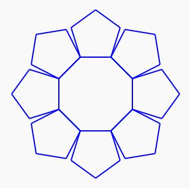

# Exercice 4

En utilisant les commandes fournies par la bibliothèque `drawing.h`, réaliser la forme présentée ci-dessous. Les différents cotés de la forme font 50 px.

@[Sample paper]({"stubs": ["main.c"],"command": "sh /project/target/run.sh", "project" : "drawing"})