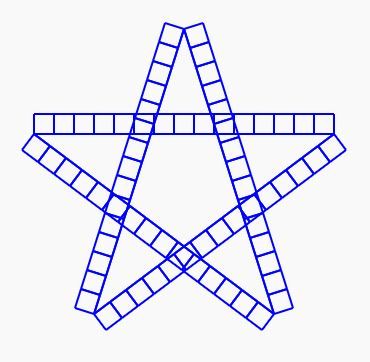

# Exercice 5

En utilisant les commandes fournies par la bibliothèque `drawing.h`, réaliser la forme présentée ci-dessous. Penser bien à décomposer le problème en sous-problème.

@[Exercice 5]({"stubs": ["main.c"],"command": "sh /project/target/run.sh", "project" : "drawing_5"})